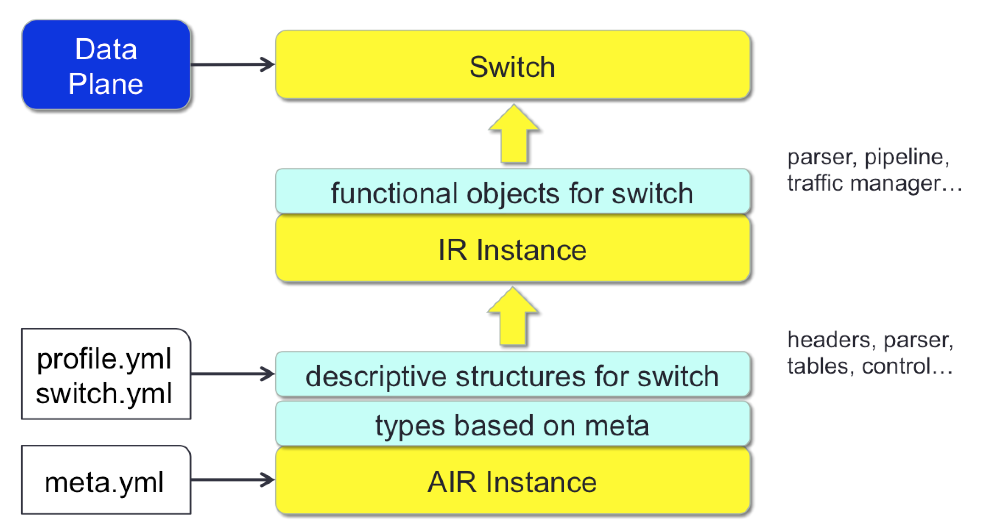

AIR and IRI: An IR and Implementation
=====================================

This repository contains code related to ongoing work under the
aegis of Protocol Independent Forwarding (PIF).

See the Doxygen generated documentation, and in particular the AIR and
IRI readme files (under Related Pages).

Getting Started
========

See the **Detailed Getting Started** below for installing dependencies.

AIR
===

AIR, which just stands for An Intermediate Representation, is a high
level framework for describing network forwarding processing logic
and composing that logic into a functioning switch.

AIR uses YAML for its specification, both for the metalanguage
specification and for the specification of a switch instance.

Here is a high level diagram showing how AIR and IRI relate.

Default AIR metalanguage
------------

The following types are defined in air_meta.yml.  

TODO: Only a few of these are documented currently.

- value_set : A run time managed container of values that may
be referenced, for example, by parser states for checking if a
select value is in a given set.
- value_map : A run time managed container that is implemented
as a key-value map.
- table :
  - match_on : A map from field references to match types (exact,
ternary, valid, lpm) which forms the key for the table lookup.
  - allowed_actions : This attribute is ignored by AIR and IRI currently,
but allows the protocol designer to call out the actions that are allowed
to be referenced by entries in this table.
- header
- metadata
- action
- parse_state
- parser
- control_flow
- traffic_manager
- processor_layout

IRI
===

IRI is a simple Python based implementation of the AIR framework. It
accepts an instance of an AIR switch specification and instantiates
a switch conforming to the logic described.

IRI uses the OFTest framework data plane implementation. This allows
the switch to use ethernet, virtual ethernet, TCP sockets or UDP
sockets as the port interfaces.

Dependencies
------------

- Python 2.7+ (but may not be Python 3 compatible)
- pydot and yaml for graphical tools and parsing

The port abstraction uses the Python VPI module which is distributed
in conjunction with OFTest and BigCode infrastructure:
- git@github.com:floodlight/bigcode.git
- git@github.com:floodlight/oftest.git

NOTE: pcap as a means of controlling veths is not yet working
- This should work, but is having trouble; suggest NOT installing python-pypcap

For documentation:
- Doxygen
- doxypy

For coverage:
- Python coverage: sudo pip install coverage (requires pip)

Initial Goals
-------------

- Fixed length headers
- Header stacks
- Very simple queuing model 
  - Strict and round_robin disciplines
  - No queue length limits
  - No multicast support

Next Steps
----------

- Variable length headers (as per IPv4 options)
- Support weighted and/or deficit round robin disciplines
- Support tail dropping in queuing
- Counters for queues
- Multicast

Future Goals
------------

- TLV parsing
- Support custom queuing disciplines

Detailed Getting Started
============

This section assumes Ubuntu as the base install.

Install Required Packages
----------

- You should be able to check out repositories from github.
  - If you can't, first run: sudo apt-get install git
  - See github.com for getting a log in ID

- Download the IR repo
  - git clone git@github.com:OpenNetworkingFoundation/air_iri.git

- Run the install script to get the required packages:
  - cd air_iri/tools
  - sudo ./install_pkgs.sh
  - This **should have** installed the following 
    - Install Python: sudo apt-get install python-all
    - Install Python development: sudo apt-get install python-dev
    - Install libpcap: sudo apt-get install libpcap-dev
    - Install swig: sudo apt-get install swig
    - Install pkg-config: sudo apt-get install pkg-config
    - Install tools for debian: sudo apt-get install python-stdeb devscripts
    - Install Python yaml tools: sudo apt-get install python-yaml
    - Install Python graphical tools: sudo apt-get install python-pydot 
    - Install Scapy: sudo apt-get install python-scapy 
    - Install Doxygen: apt-get install doxygen
    - Install Doxygen python preprocessor: apt-get install doxypy

You may need to update the Python package if it is installed, but outdated.

Run AIR/IRI Unit Tests
-------

- cd air_iri
- make test

Set Up The Data Plane
-------

- Create veth ports
  - cd air_iri
  - sudo tools/veth_setup.sh

Note: Support for Virtual Port Interfaces will be coming

Run the IRI Switch
-------

- Start the switch
  - cd air_iri
  - make start-l3

You should see output like the following.

    ~/pkg/air_iri$ START_YML=l3.yml make start

    sudo PYTHONPATH=.:submodules/oftest/src/python ./start.py -v l3.yml
    INFO:root:Creating IRI switch instance
    INFO:root:Starting dataplane
    WARNING:dataplane:Missing pypcap, VLAN tests may fail. See README for installation instructions.
    INFO:root:Adding port veth0
    INFO:root:Adding port veth2
    INFO:root:Adding port veth4
    INFO:root:Adding port veth6
    INFO:root:Starting IRI Switch instance ichiban
    INFO:root:Opening AIR input file: l3.yml
    INFO:root:Creating parser parser
    ... (more debug output)
    INFO:root:IR switch ichiban running

- Send packets to the switch 
  - You can do this by running the basic OFTest instance
  - cd air_iri/submodules/oftest
  - sudo ./oft pktact.PacketOnly --verbose

Roadmap
========

This is an unorganized list of things to work on going forward

- Controller interface
  - Support OpenFlow interface
  - Generate table update APIs
  - Expose table update APIs through Thrift
- Manifest: A manifest would be a list of files that should
be aggregated into a single YAML input before being processed.
This would centralize the control and order of file inclusion
and replace the need for processing "include", "import" or
"require" directives in the source files themselves. 
- Templating for output. There is currently a templates branch
which has some initial code for processing tenjin template
files.

